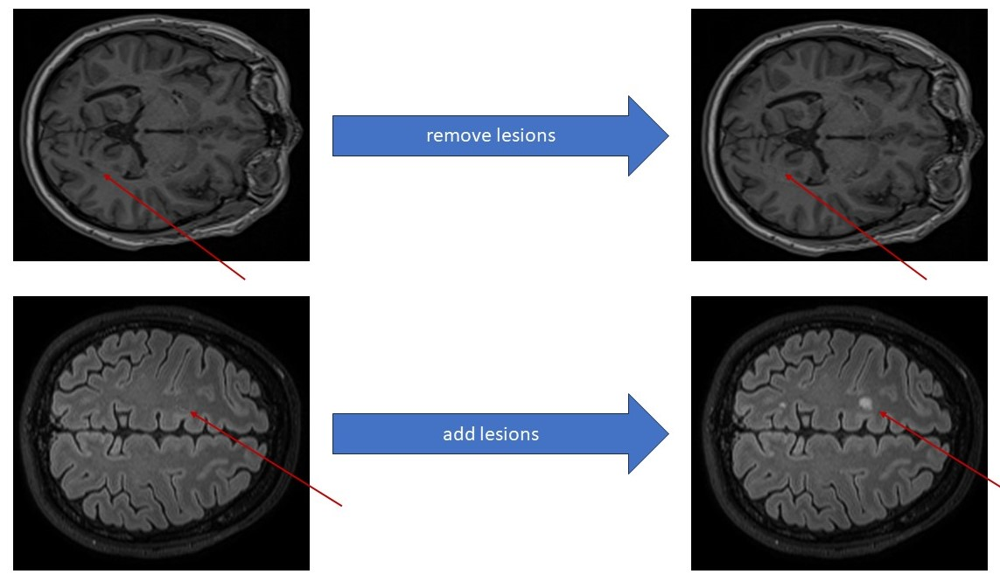

## Abstract
White matter (WM) lesions, often associated with neurological conditions like multiple sclerosis (MS), can significantly distort cortical thickness measurements obtained from magnetic resonance imaging (MRI). Traditional methods often rely on lesion filling techniques to address this issue. This thesis explores the potential of deep learning to enhance the accuracy and efficiency of cortical thickness measurement in the presence of WM lesions. One major hurdle in deep learning projects for medical images is the scarcity of large datasets. To overcome this limitation, this thesis investigates in the generation of synthetic data.

Among various approaches, two noise diffusion models with a pseudo-3D U-Net architecture conditioned on binary masks proved to be the most effective in filling and synthesizing WM lesions in MR-images. To assess the quality of the synthesized lesions, two experienced neuroradiologists were asked to identify 20 synthetic lesions among a set of 20 patients. Only three synthetic lesions were correctly identified, highlighting the high realism of the generated lesions.

Furthermore, this thesis compared the robustness of different computational methods for cortical thickness measurement in the presence of WM lesions. Newer deep learning-based methods demonstrated greater robustness, suggesting that lesion filling might eventually become obsolete.

