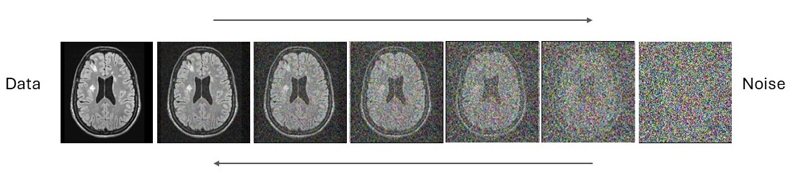

## Background 
Multiple sclerosis lesions are the result of demyelination: They appear as dark spots on T1 weighted MRI imaging and as bright spots on FLAIR MRI imaging. Image analysis for MS patients requires both the accurate detection of new and enhancing lesions, and the assessment of atrophy via local thickness and/or volume changes in the cortex. Detection of new and growing lesions is possible using deep learning, but made difficult by the relative lack of training data: Meanwhile cortical morphometry can be affected by the presence of lesions, meaning that removing lesions prior to morphometry may be more robust. Existing ‘lesion filling’ methods are rather crude, yielding unrealistic-appearing brains where the borders of the removed lesions are clearly visible.

## Aim
Denoising diffusion networks are the current gold standard in MRI image generation: We aim to leverage this technology to remove and add lesions to existing MRI images. This will allow us to create realistic synthetic MRI images for training and validating MS lesion segmentation algorithms, and for investigating the sensitivity of morphometry software to the presence of MS lesions at a variety of lesion load levels.

